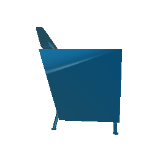
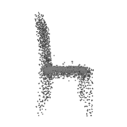

# CMSC848F: Assignment 2
**Submission By : Vineet Singh (UID: 119123614)**

# Section 1: Exploring loss functions
-------------------------------------------------------------------------------

## Subsection 1.1
Fitting a 3D voxel grid using Binary Cross Entropy loss 

Command to run the code: 
Run the file python `fit_data.py --type 'vox'`, to fit the source voxel grid to the target voxel grid.

| |  |
| --- | --- |
|Ground Truth Voxel Grid | Optimized Voxel Grid | 

## Subsection 1.2
Fitting a point cloud using Chamfer loss

Command to run the code: 
Run the file `python fit_data.py --type 'point'`, to fit the source point cloud to the target point cloud.

| |  |  |
| --- | --- | --- |
|Ground Truth Point Cloud | Optimized Point Cloud (10K iteration) | Optimized Point Cloud (15K iteration) | 

## Subsection 1.3
Fitting a Mesh and smoothening using Laplacian loss

Command to run the code: 
Run the file `python fit_data.py --type 'mesh'`, to fit the source mesh to the target mesh. 

| |  |
| --- | --- |
|Ground Truth Mesh | Optimized Mesh | 

# Section 2: Reconstructing 3D from Single View

For estimating 3D model from a single image, a ResNet18 architecture is used. 
Different models of decoder are used to analyze the results.

For estimating to voxels, an Implicit Decoder is used. 
For estimating to mesh or point clouds, two different decoders (as given below) are used and analyzed for performance. 

**Model1**:  
nn.Sequential(nn.Flatten(), 
nn.Linear(512, 1024), 
nn.ReLU(), 
nn.Linear(1024, 4096), 
nn.ReLU(), 
nn.Linear(4096, self.n_point * 3)) 

**Model2**: 
nn.Sequential(nn.Flatten(), 
nn.Linear(512, 512), 
nn.ReLU(), 
nn.Linear(512, 1024), 
nn.ReLU(), 
nn.Linear(1024, 2048), 
nn.ReLU(), 
nn.Linear(2048, 2048), 
nn.ReLU(), 
nn.Linear(2048, 2048), 
nn.ReLU(), 
nn.Linear(2048, self.n_point * 3)) 

## Subsection 2.1: Image to Voxel Grid
Decoder Used: ImplicitMLPDecoder 
Batch size: 4 
Training Iterations: 10K

Run the file `python train_model.py --type 'vox'`, to train single view to voxel grid pipeline.

After trained, visualize the input RGB, ground truth voxel grid and predicted voxel in `eval_model.py` file using:
`python eval_model.py --type 'vox' --load_checkpoint`

|Input Image | Ground Truth | Estimated Voxel |
| --- | --- | --- |
| |  |  |
| |  |  |
| |  |  |

## Subsection 2.2: Image to Point Cloud
Decoders Used: Model 1 and Model 2
Batch size: 32
Training Iterations: 10K

Run the file `python train_model.py --type 'point'`, to train single view to pointcloud pipeline.

After trained, visualize the input RGB, ground truth point cloud and predicted  point cloud in `eval_model.py` file using:
`python eval_model.py --type 'point' --load_checkpoint`

|Input Image | Ground Truth | Estimated Point Cloud (Model 1) | Estimated Point Cloud (Model 2)
| --- | --- | --- | --- |
| |  |  |  |
| |  |  |  |
| |  |  |  |

## Subsection 2.3: Image to Mesh
Decoders Used: Model 1 and Model 2
Batch size: 32
Training Iterations: 10K

Run the file `python train_model.py --type 'mesh'`, to train single view to mesh pipeline.

After trained, visualize the input RGB, ground truth mesh and predicted mesh in `eval_model.py` file using:
`python eval_model.py --type 'mesh' --load_checkpoint`

|Input Image | Ground Truth | Estimated Mesh (Model 1) | Estimated Mesh (Model 2)
| --- | --- | --- | --- |
| |  |  |  |
| |  |  |  |
| |  |  |  |

## Subsection 2.4: Quantitative Comparison 
The f1-score was compared for all the methods of estimation. The graphs are shown for 2 different training done with model 2 decoder.

Command to generate the graphs chosing the correct type:
`python eval_model.py --type voxel|mesh|point --load_checkpoint`

When the model is trained on batch size of 32 for Mesh and Point and 4 for Voxel. 
|Voxel | Point | Mesh |
| --- | --- | --- |
| |  |  |

When the model is trained on batch size of 2. 
|Voxel | Point | Mesh |
| --- | --- | --- |
| |  |  |

As evident, the reconstruction is best for point cloud rendering as the f1 scores almost reaches 100 and almost similar values for mesh. However Voxels lag behind. 
So we can conclude that Mesh/Point performs better on f-1 score. 

Also a notable difference in f1-score when the batch size during training is increased. It leads to better f-1 score overall. 

## Subsection 2.5: Effects of Hyperparameter Variations

The Hyperparameters evaluated are: 
### 1. Training Batch size

|Ground Truth | Estimated Mesh (Batch size: 2) |Estimated Mesh (Batch size: 32) |
| --- | --- | --- |
| |  |  |

|Ground Truth | Estimated Point Cloud (Batch size: 2) |Estimated Point Cloud (Batch size: 32) |
| --- | --- | --- |
| |  |  |

In conclusion, it can be said that by increasing the batch size the model trains much better. Theoretically this makes sense, 
as by increasing the batch size, the optimization is now happening over a bigger set of data, which leads to better minimum reach. 
Hence the performance increases, however, too big batch size is not desirable because of the compute and memory requirement.

### 2. No. of points

Below comparison shows the effect of number of points during training on the prediction results.
Trained with Decoder model 2 and batch size 2.

|Ground Truth | 500 Points | 2K points 
| --- | --- | --- | 
| |  |  |

| 5K points | 9K points |
| --- | --- |
|  |  | 

## Subsection 2.6: Model Interpretation

To understand how the model learn to shape the initial point cloud (which is shaped as a sphere) as an estimate 3D model where 
each point estimated by the network. 

|Ground Truth | Initial PC | 1K iterations | 5K iterations | 9K iterations |
| --- | --- | --- | --- | --- |
| |  |  ||  |

The images show how the model evolve over training iterations. 
The comparison is done for model trained with batch size of 32.
